## Performance Testing Result
### Test Plan 1: `/all-student-request`
- View Result Tree
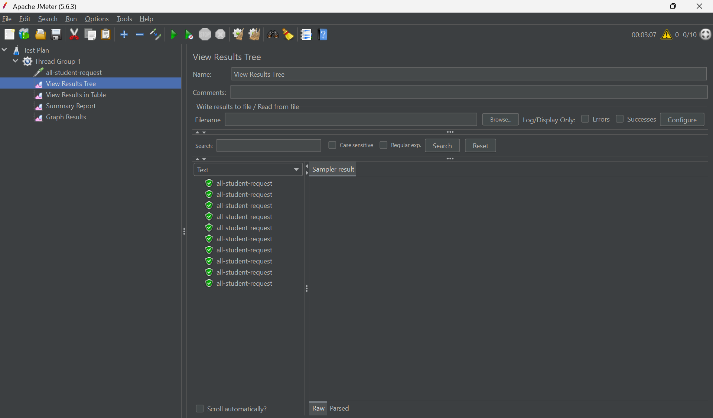
- View Results in Table
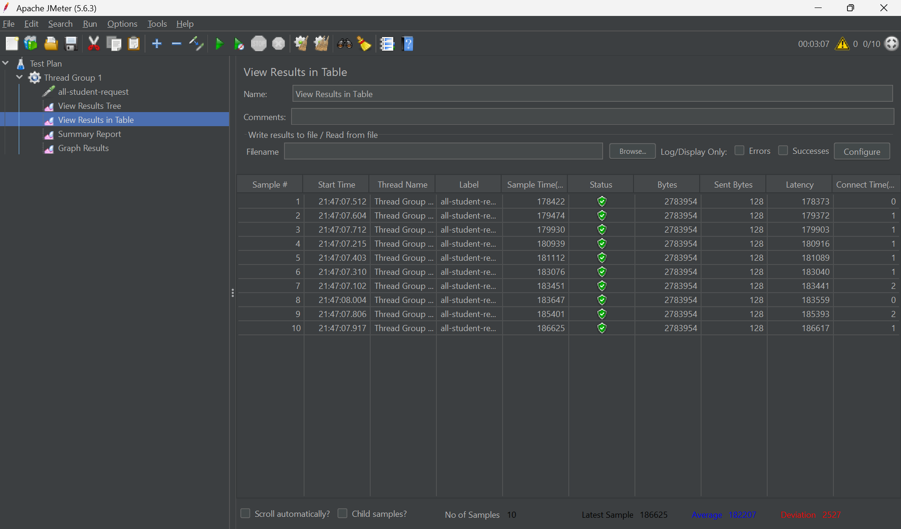
- Summary Report
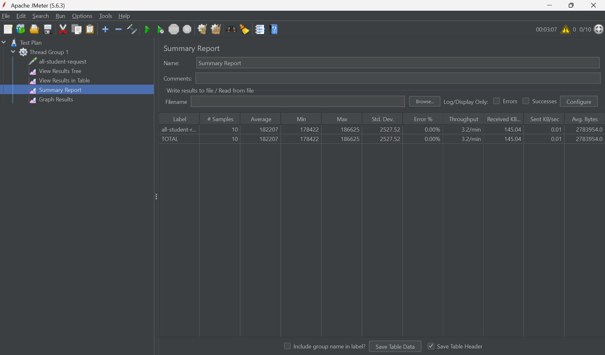
- Graph Results
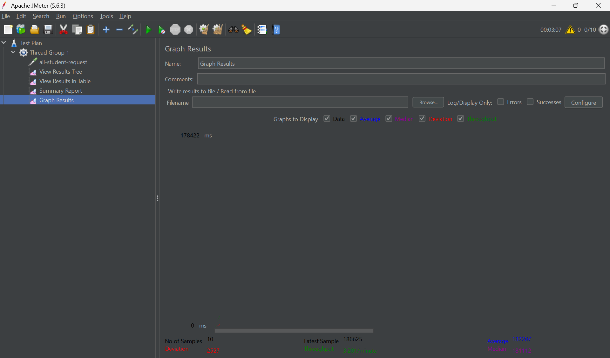
- CLI
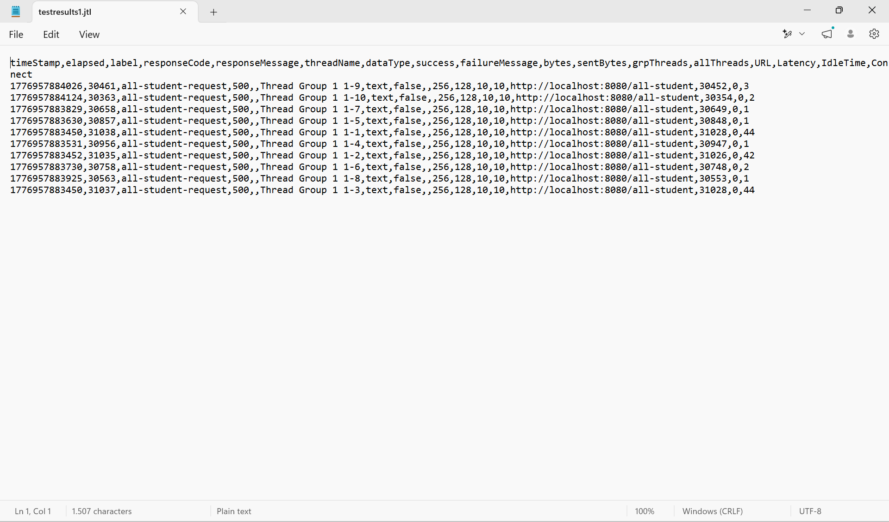
- After Refactoring
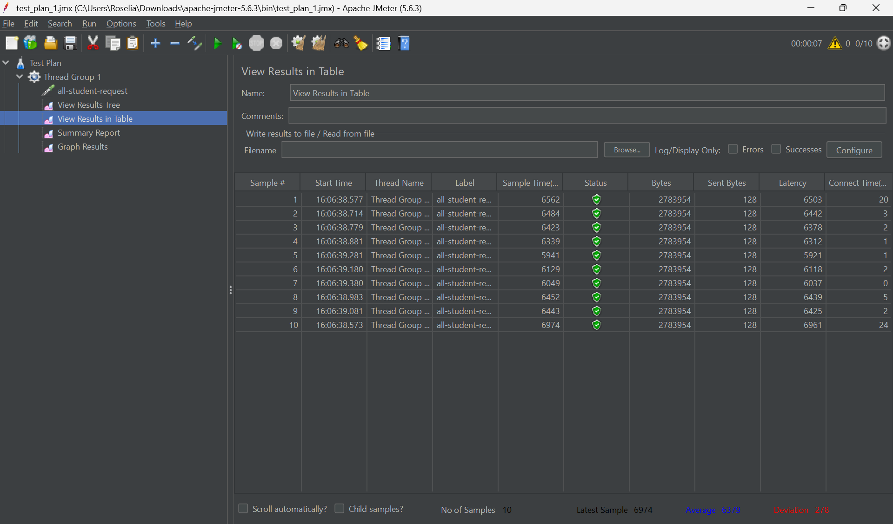

### Test Plan 2: `/highest-gpa`
- View Result Tree
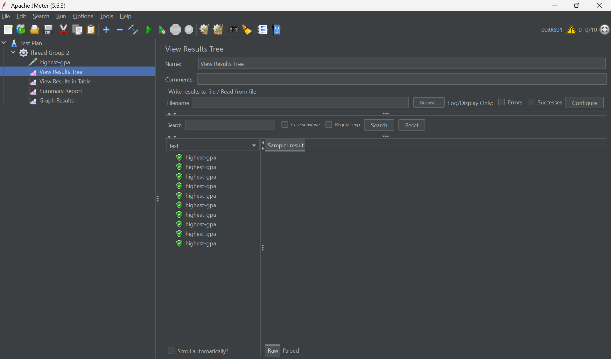
- View Results in Table
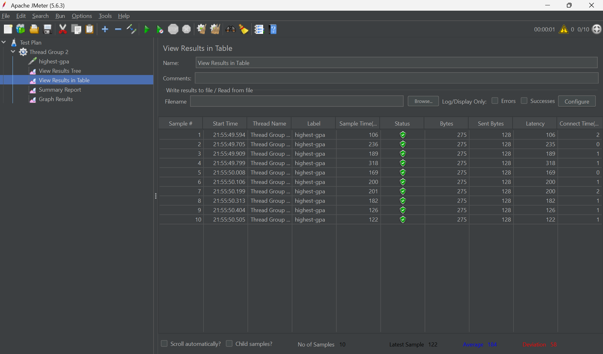
- Summary Report
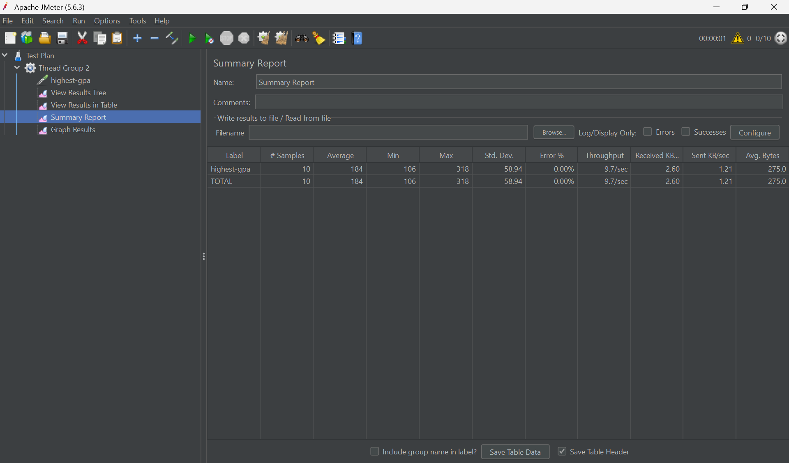
- Graph Results

- CLI
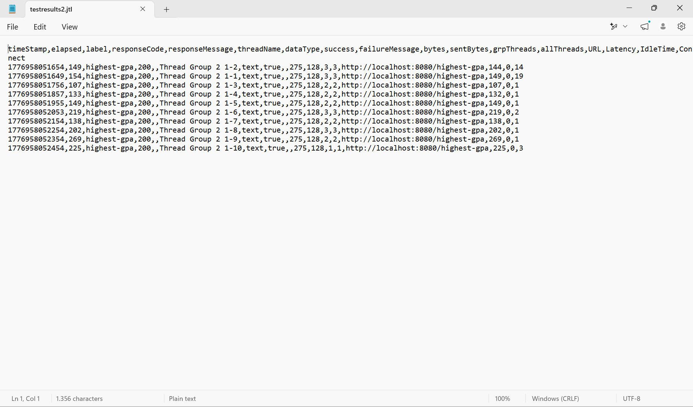
- After Refactoring
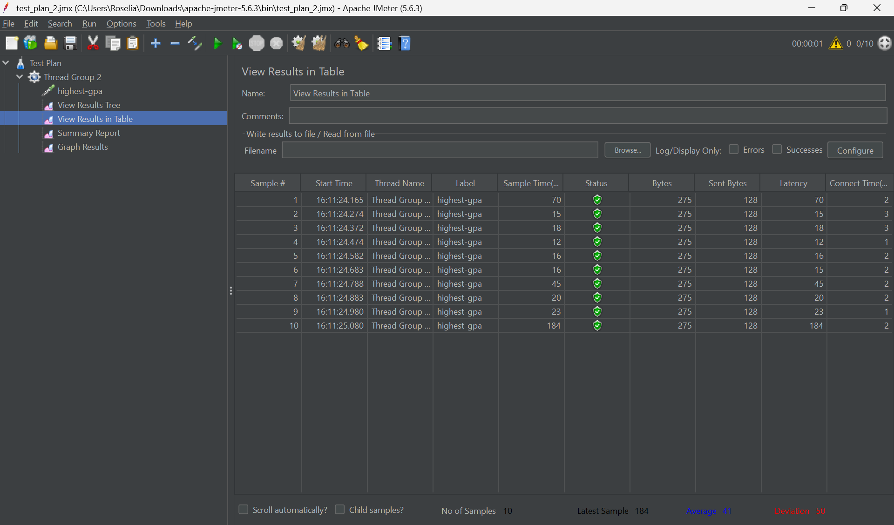

### Test Plan 3: `/all-student-name`
- View Result Tree
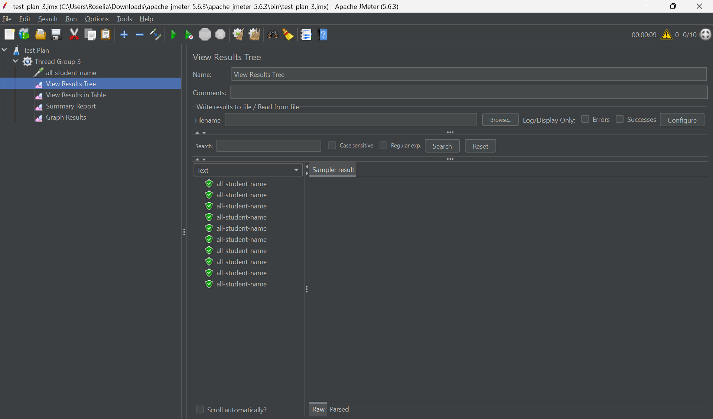
- View Results in Table
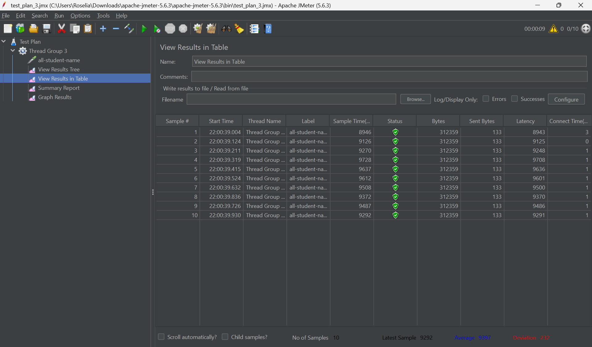
- Summary Report
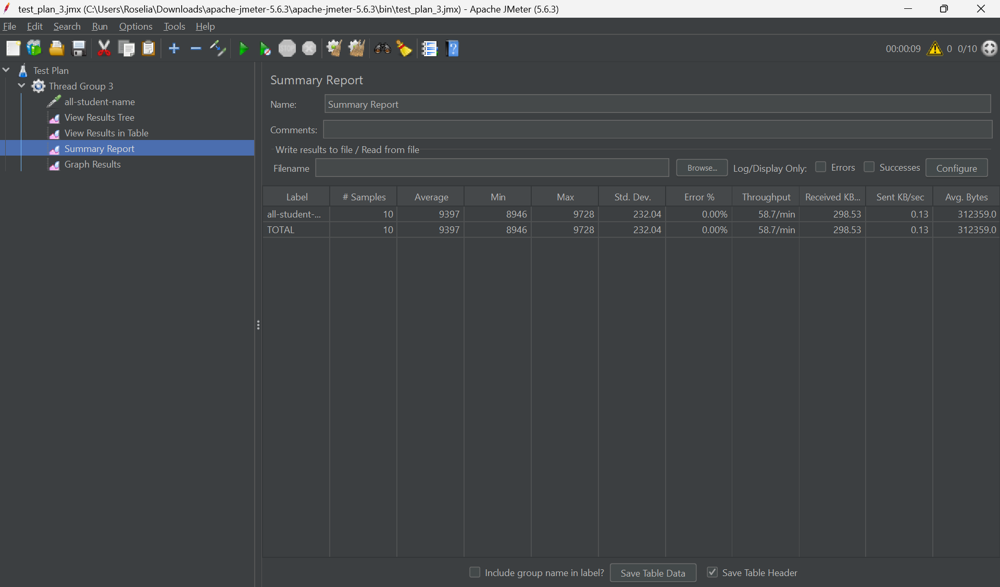
- Graph Results
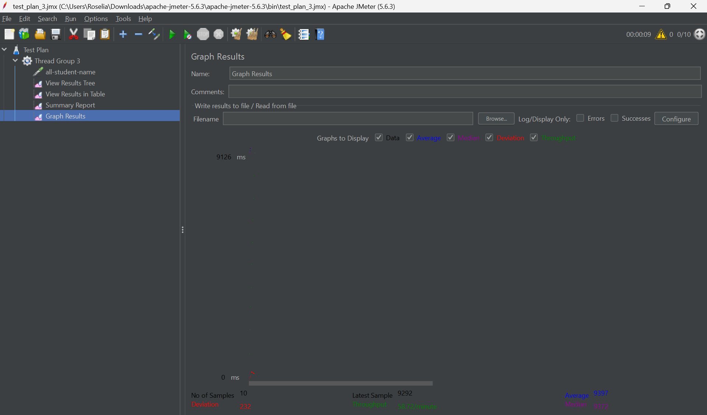
- CLI
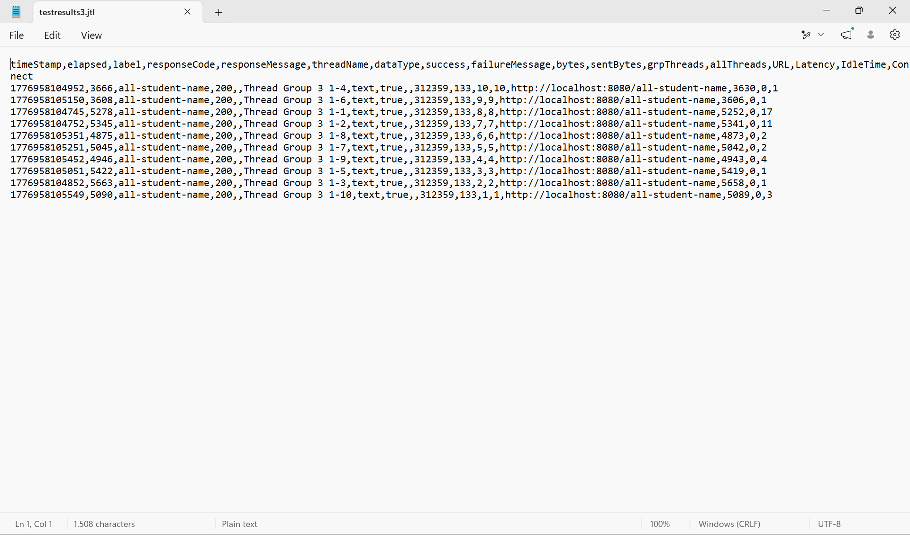
- After Refactoring

Berdasarkan hasil sebelum dan setelah optimisasi, terdapat peningkatan efisiensi yang signifikan. Untuk `/all-student`, `highest-gpa`, dan `all-student-name`, ketiga endpoint menunjukkan penurunan sample time, latency, dan average sample time yang signifikan. Pada hasil JMeter, terlihat bahwa average sample time untuk endpoint `all-student` sebelum optimasi adalah 9397, setelah dioptimasi menjadi 94.  Untuk endpoint `highest-gpa`, average sample time sebelum optimasi adalah 1822207, setelah dioptimasi menjadi 6379. Untuk endpoint `all-student-name`, average sample time sebelum optimasi adalah 184, setelah optimasi menjadi 41. Hasil ini menunjukkan bahwa optimasi berhasil mengurangi waktu eksekusi dan mempercepat performa aplikasi. 

## Profiling
1. `/all-student`
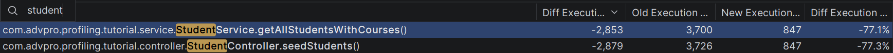
2. `/highest-gpa`
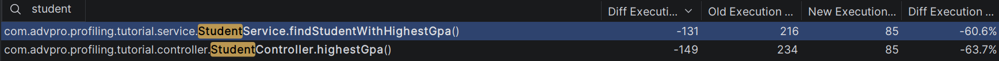
3. `/all-student-name`
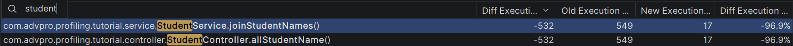